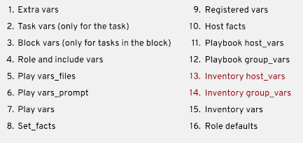

# Ansible Essentials

## Introduction to Ansible

## What is Ansible and the Ansible Way

* Ansible is an automation language (declarative, generally yml) that describes IT Application infrastructure in **Ansible Playbooks**
* Ansible Playbooks run on an automation engine.
* **Ansible Towers** - Enterprise framework for controlling, securing and managing the Ansible Automation with UI and RESTful API.

### Ansible is simple
* Human readable automation
* No special coding skill needed
* Sequential task assignment
* Improves productivity

### Ansible is powerful
* Application deployment
* Configuration Managemnt
* Workflow Orchestration
* Orchestrate the Application Lifecycle

### Ansible is Agentless
* Agentless architecture
* Uses OpenSSH and WinRM
* No agents to exploit or update
* Efficient and Secure

### Ansible is Cross Platform

### Ansible is compatible with existing toolkits
* Comes bundeled with 450 modules

### Community - GitHub Community

### Ansible is the complete Package
1. Configuration Management
2. Application Deployment
3. Multi-Tier Orchestration
4. Provisioning

**Configuration Management or State Management:** Setup base state for the device with all dependencies and configurations.
* Security
* Compliance
* Orchestration
* Continuous delivery
* Provisioning

### Installing Ansible
```
$ sudo apt-get install ansible
```
or
```
$ sudo yum install ansible
```
or
```
$ pip install ansible
```

## How Ansible Works


* Users create Ansible Playbook

**Ansible Playbooks:** Declarative language called YAML (Yet Another Markup Language)
Ansible Playbooks invoke **Ansible Modules**

### Ansible Automation Engine
1. Inventory
2. Modules
3. API
4. Plugins

**Modules:** Tools in the Toolkit
Written in Python, Powershell etc.

**Inventory:** Modules are stored on nodes or groups.

**Infrastrucute:** Nodes and groups must be stored somewhere ((Public/Private Cloud))
- Cloud
- Custom CMDB

**Plugins:** Code that plugs into core engine

**Commonly used modules** - 450 total
1. copy
2. file
3. apt
4. yum

https://docs.ansible.com/ansible/latest/modules/modules_by_category.html

**Run command modules**
1. command: execute command but not via shell - direct and secure
2. Shell: execute command through a shell like bash
3. Script: local script execution on remote node
4. Raw: execure command without going through Ansible module subsystem - pure ssh command without Python use case.

## Ad-hoc commands

* Check all hosts are up 
```
$ ansible all -m ping # -m is used to pass commands to ansible
```
```
$ ansible all -i [inventory file] -u [host file name] -m ping # -i is used to pass Inventory file to Ansible, -u is used to pass the host/node type or name
```
Eg: `$ ansible all -i hosts -u vagrant -m ping`


* Check the uptime of all hosts in a specific group
```
$ ansible [group name] -m command -a "uptime" # Command with argument uptime $ command uptime
```

* Check localhost configuration
```
$ ansible localhost -m setup
```

* We know that all commands and modules run on inventory - hosts (nodes) or groups (collection of hosts)

**Inventory:** Collection of hosts against which Ansible can work with.
* Hosts - network devices/ containers/ nodes etc.
* Groups
* Static or Dynamic source
* Inventory specific data

* Check inventory details - groups and IP address of each node is shown
```
$ cat [hosts file]
```

* Gather machine information
```
$ ansible all -i hosts -u vagrant -m setup
```

* Install packages
```
$ ansible [group name/all] -i hosts -u vagrant -m yum -a "name=httpd state=present" -b # a for arguments and b for assigning permission to vagrant user
```

**Generic Ansible command**
```
$ ansible [group name/all] -i [inventory file] -u [hosts] -m [command name] -a [arguments to the command]
```

* Ansible is Idempotent - Re-running same command checks for previous state and does not repeat tasks

* Delete Packages
```
$ ansible [group name/all] -i hosts -u vagrant -m yum -a "name=<package> state=absent" -b
```

## Introduction to Playbooks

### Variables 
* Account for difference in servers, groups and hosts.
* Ansible works with metadata from various sources and manages their context in form of variables.

**Variable Precedence** - Overriding predecence
* 16 levels of precedence
* Extra vars have the highest precedence
* Role defaults have the lowest precendence



**Variables can be**
1. file
2. yum
3. service: service should be running
4. template: config file
5. get_url: Fetch archive from url
6. git: clone a source code repo

**Tasks:** Declarative tasks for variable - RUN SEQUENTIALLY

```
tasks:
  - name: add cache directory
    file:
      path: /opt/cache
      state: directory

  - name: install nginx
    yum:
      name: nginx
      state: latest

  - name: restart nginx
    service:
      name: nginx
      state: restarted
```

**Handler Tasks** Triggered on certain events
* Special tasks
* **Run at the end of play regardless the number of times they are triggered during the play**
* Manually triggered from normal tasks using the **notify keywords**

```
tasks:
  - name: add cache directory
    file:
      path: /opt/cache
      state: directory

  - name: install nginx
    yum:
      name: nginx
      state: latest
    notify: restart nginx

handlers:
  - name: restart nginx # Must be same as notify command argument
    service:
      name: nginx
      state: restarted
```

**Play:** Ordered set of tasks to be executed against hosts selection in our inventory

**Playbooks** file consisting of all plays in workspace.

```
- name: install and start apache
  hosts: web # group name
  vars: 
    http_port: 80
    max_clients: 200
  remote_user: root #[user name]
  become: yes # add root permissions

  tasks:
  - name: install httpd
    yum: pkg=httpd state=latest #### Have you noted that inputs of tasks are modules!!
  - name: write the apache config file
    template: src=/src/httpd.j2 dest=/etc/httpd.conf
  - name: start httpd
    service: name=httpd state=started
```

* Another Play example - site.yml (say)
```
- name: install and start apache
  hosts: webservers
  remote_user: vagrant
  become: yes

  tasks:
  - name: install epel repp
    yum: name=epel-release state=present
  - name: install python bindings for SELinux
    yum: name={{item}} state=present # loop
    with_items:
    - libselinux-python
    libsemanage-python
  - name: test SELinx is running
    command: getenforce
    register: sestatus
    changed_when: false
  - install apache
    yum: name=httpd state=present
  - name: start apache
    service: name=httpd state=started enabled=yes
```

* Run Playbook
```
$ ansible-playbook -i [inventory file] [play name].yml
```

