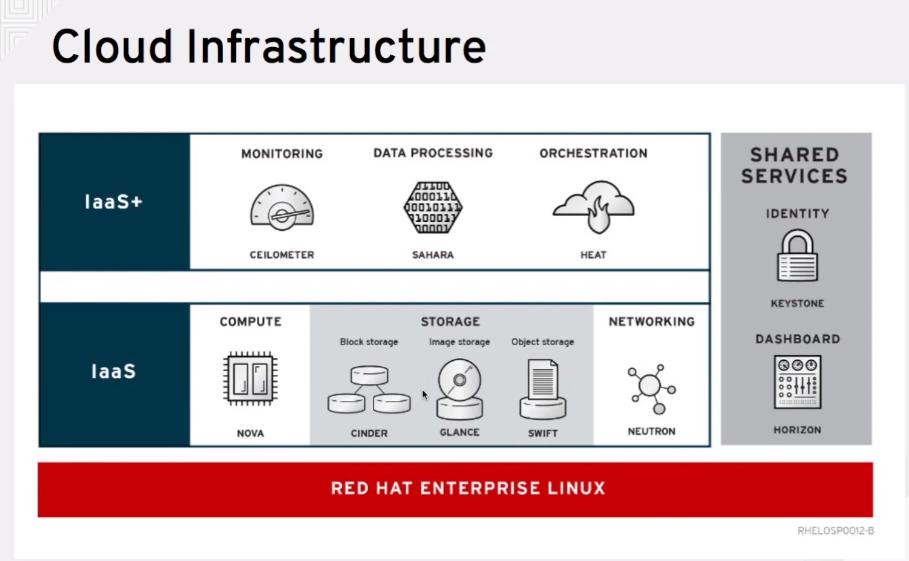

# RedHat OpenStack 

## RedHat Enterprise Linux OpenStack Platform Technical Overview

## Defining Cloud

**Cloud Computing:** Remote services on demand 
* Automated provisioning

### Essential Characteristics of Cloud

1. **Self Service** - automatic provisioning of which device service given to whom etc.
2. **Multitenancy** - consistent access by different users
3. **Elasticity** - Scale up and down
4. **Telemetry** - resource monitoring by consumer and provider

### Traditional vs Cloud Workload

* Scale out rather than up - horizontal scaling rather than vertical
* Create clones rather than upgrading the single device.
* For vertical scaling, once up difficult or should I say impossible to scale down


### Cloud Deployment Models

**1. Private Cloud** - Private to organization and they may even have their own hardware

**2. Public Cloud** - cloud service providers

**3. Hybrid Cloud** - private cloud for standard resources and public cloud for user interface.

### Infrastructure as a Service


### Platform as Service


**OpenStack is IAAS and OpenShift is PAAS**

### RedHat Cloud - Open Hybrid Cloud


* IAAS can be implemented by two ways
1. Generic Infrastructure - **RHEV-M** (Red Hat Enterprise Virtualization)
2. Cloud based - **RHELOSP** (Red Hat Enterprise Linux OpenStack Platform)

### Virtualization vs Cloud Computing

**Traditional Virtualization:** Stateful


**Cloud Infrastructure:** Greater Scalability with shared resources 



### Scalability of an application using OpenStack service - SeleMeter

* Login into Horizon Interface for RHELOSP
* Go to Project -> Orchestration -> Stacks
* Click on Launch Stack
* Template Source - URL - http://classroom.example.com/materials/heat/scaling.template
* Environment Source - override values in template

**Environment.yaml**
```
parameters:
  key_name: <<>>
  flavor: <<>>
  image: <<>>
```

* Click on next
* Give a Stack Name 
* Check rollback on failure
* Leave rest details to default
* Launch the stack
* Stack is created - now make it automatic scalable.
* Click on compute - instances
* Select an instance - click on console tab - Access console
* Run the script `$ ./launchme.sh`
* The script runs for 5 minutes and configures the scaling module and then goes into a cooldown period.
